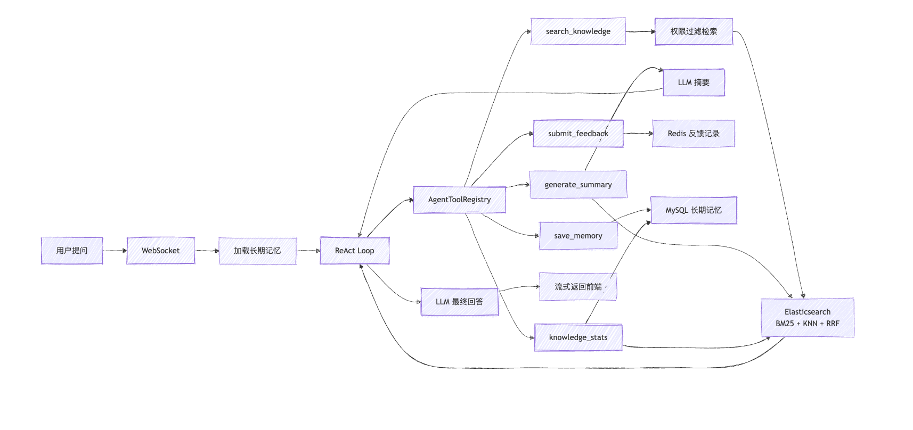

# SmartRag

SmartRag 是一个面向企业/团队内部知识库场景的智能问答系统，基于 RAG（Retrieval-Augmented Generation，检索增强生成）构建，支持文档上传、解析切块、混合检索、权限隔离、WebSocket 流式对话以及 ReAct 工具调用。

## 系统链路图



## 系统架构图


## 系统设计文档

https://www.yuque.com/duzhu-wbgee/qwagpr/ec8g2z2gxuycg11m


## 本地运行

启动前请先准备 MySQL、Redis、Elasticsearch、MinIO、Kafka 等基础设施。默认配置位于：

```text
src/main/resources/application.yml
frontend/.env*
```

后端启动：

```bash
./mvnw spring-boot:run
```

前端启动：

```bash
cd frontend
pnpm install
pnpm dev
```

## 目录说明

```text
src/main/java/com/zzzzyj/smartpai/
├── client/        # 大模型、Embedding 等外部客户端
├── config/        # Spring Security、Redis、Kafka、MinIO、ES 等配置
├── consumer/      # Kafka 异步消费链路
├── controller/    # REST API
├── handler/       # WebSocket 处理器
├── model/         # 数据模型
├── repository/    # JPA Repository
├── service/       # 核心业务逻辑
└── utils/         # 工具类

frontend/
├── src/views/     # 页面组件
├── src/store/     # Pinia 状态管理
├── src/service/   # 前端接口封装
└── src/layouts/   # 页面布局
```
